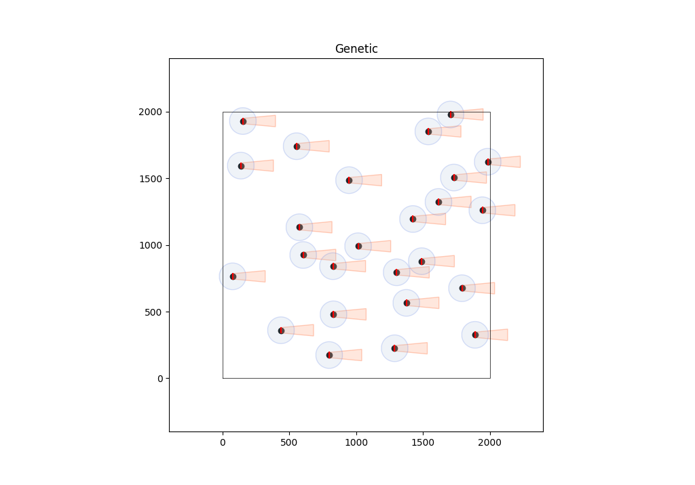

# AE755 - Optimisation

## Results
### Genetic Algorithm

User parameters:

    Number of turbines: 25
    Cost Function: Mosetti
    Wind Speed: 12 m/s
    Hub height: 60 m
    Rotor diameter: 40 m
    Wind Farm: 2000 x 2000 m^2

Algorithm parameters:

    Number of generations: 150
    Population size: 200
    Elite Number: 10
    Crossover fraction: 0.8
    Mutated genes: 2 (each single parent)

Lowest Cost: 0.001023

